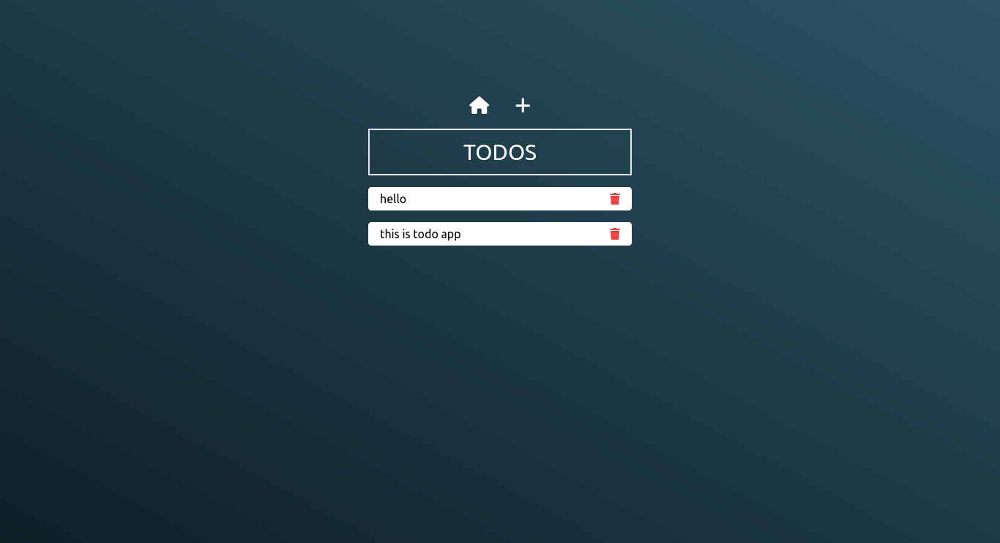
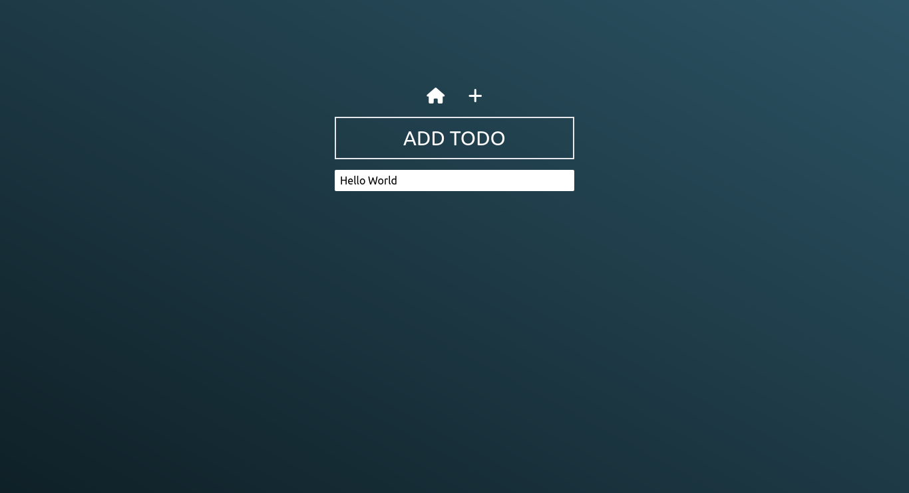

# First NodeJS Project

NodeJS, Express.js kullanarak geliştirdiğim başlangıç projem.Bu projede öğrendiklerim: 
* EJS template kullanımı
* Express.js ile routing
* static dosya kullanımı
* method-override ile DELETE methodunu taklit etmek
* MVC yapısını örnek bir projede kullanmak

---
## Requirements

Geliştirme için yalnızca Node.js'ye ve ortamınızda kurulu bir düğüm global paketi olan npm'a ihtiyacınız olacak.

## Install

    $ git clone https://github.com/ogzcode/First-NodeJS-Project.git
    $ cd First-NodeJS-Project
    $ npm install

## Running the project

    $ npm start

## Ekran Görüntüleri

